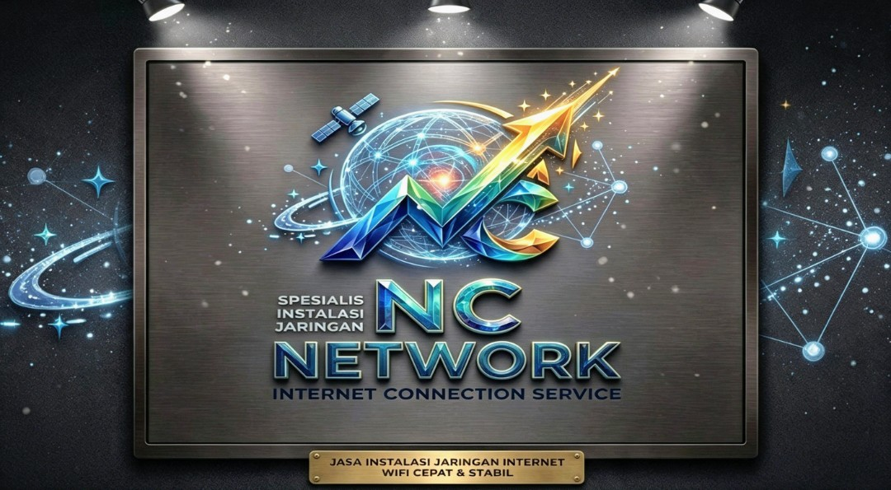
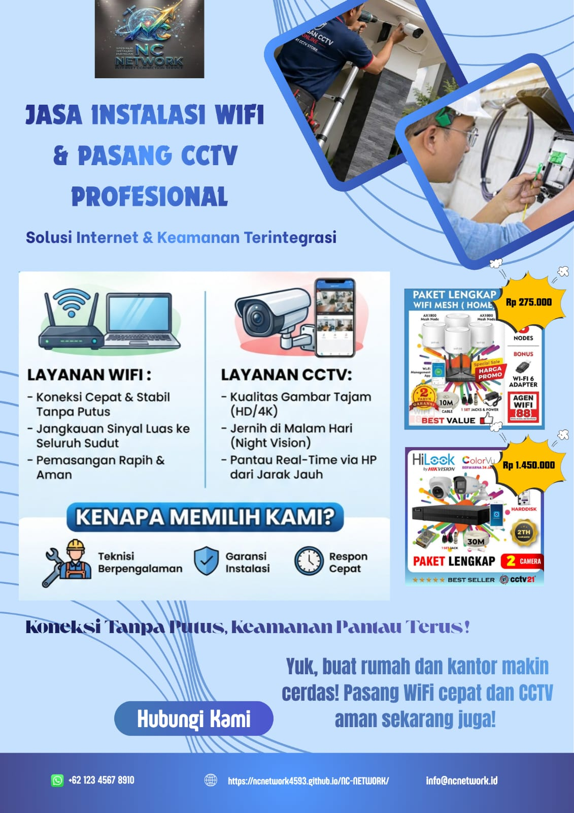
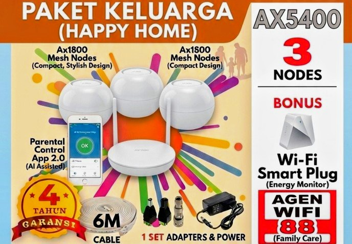
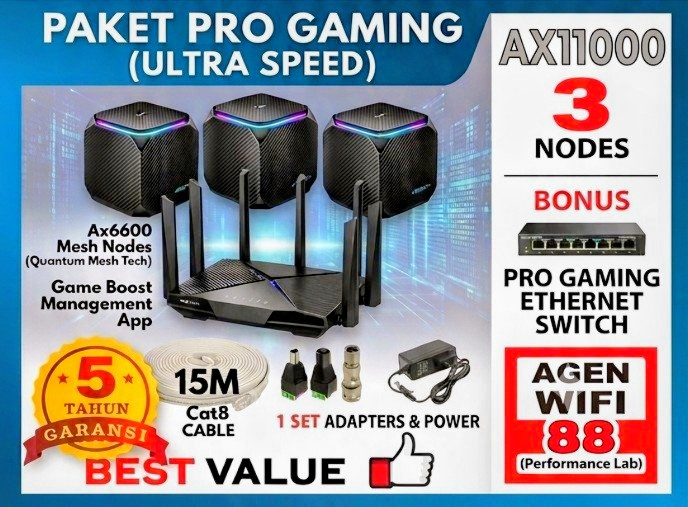
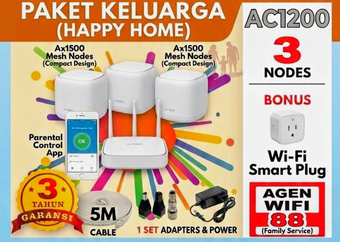
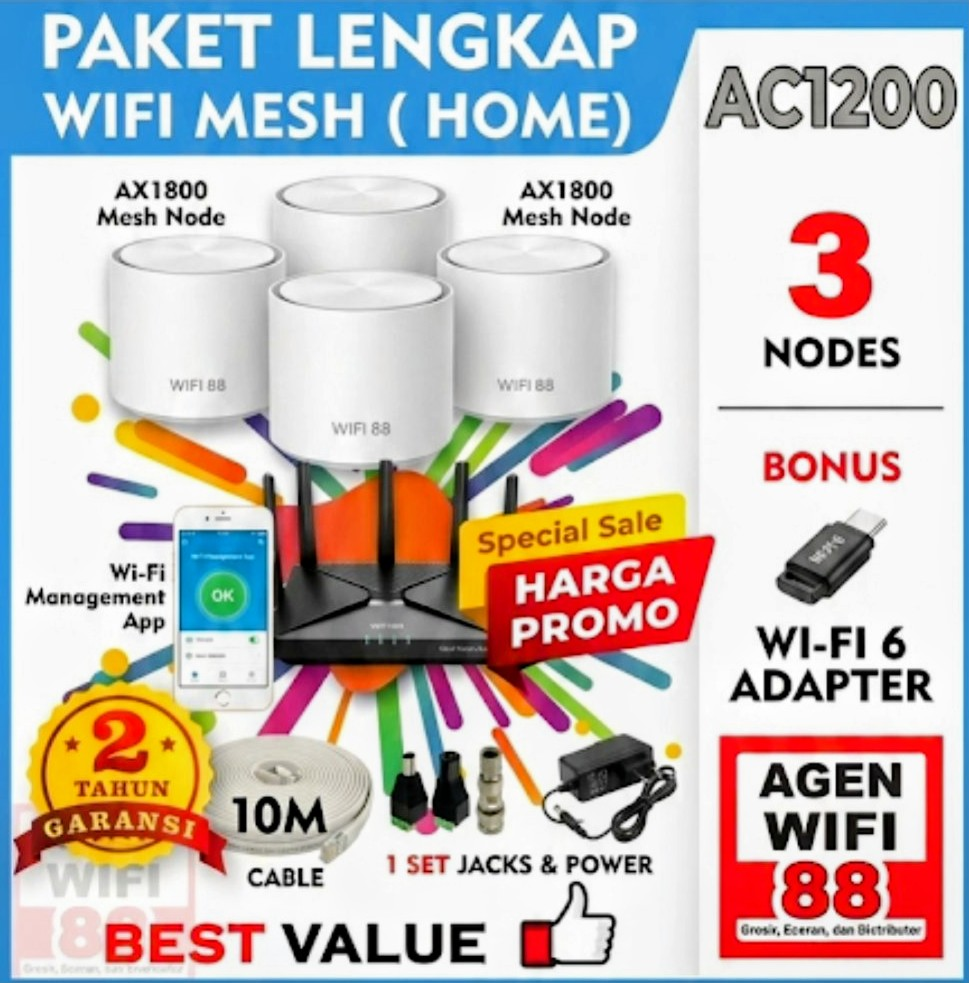
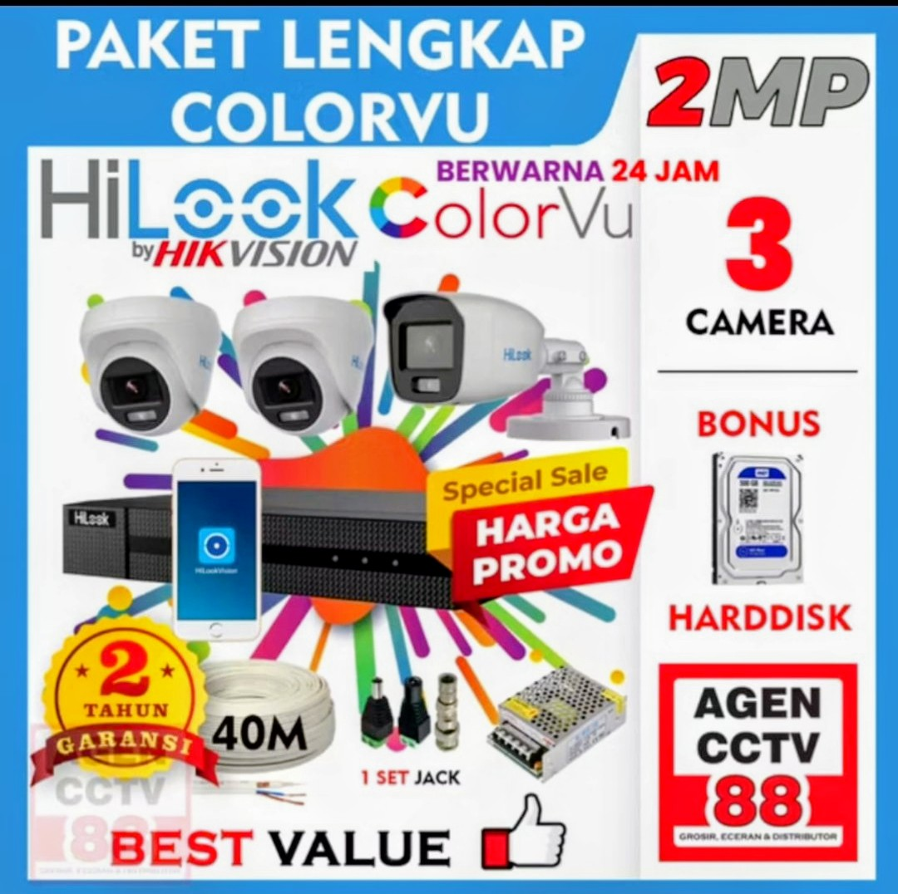
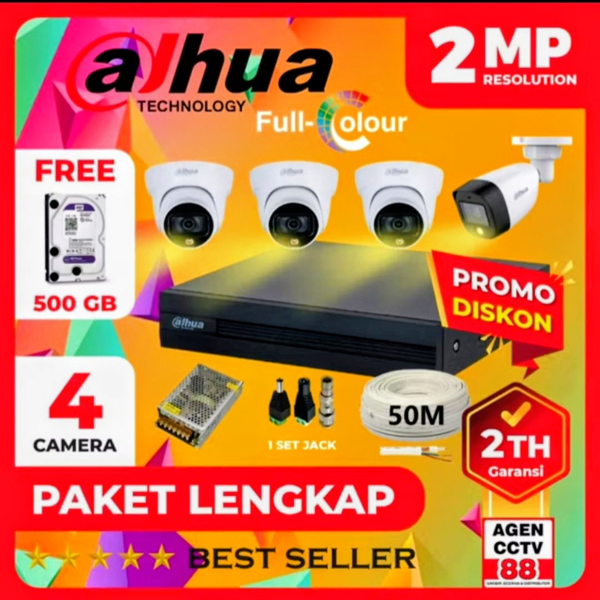
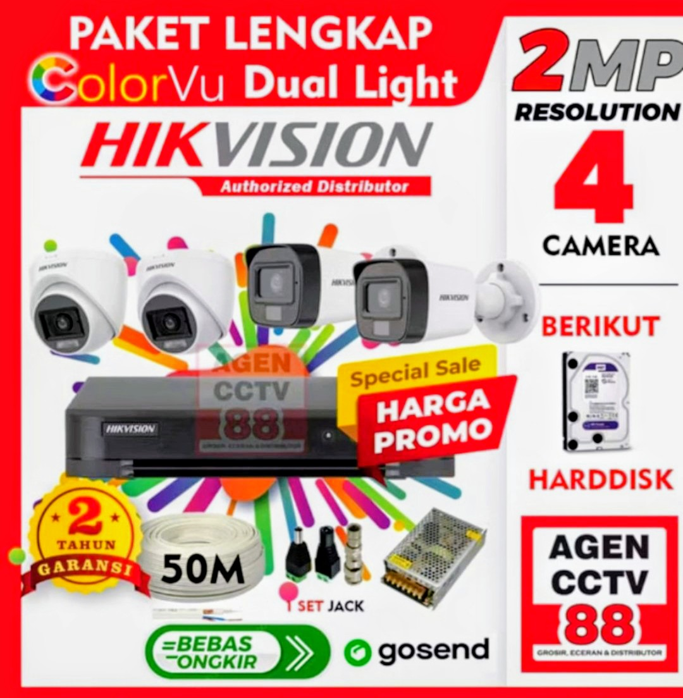
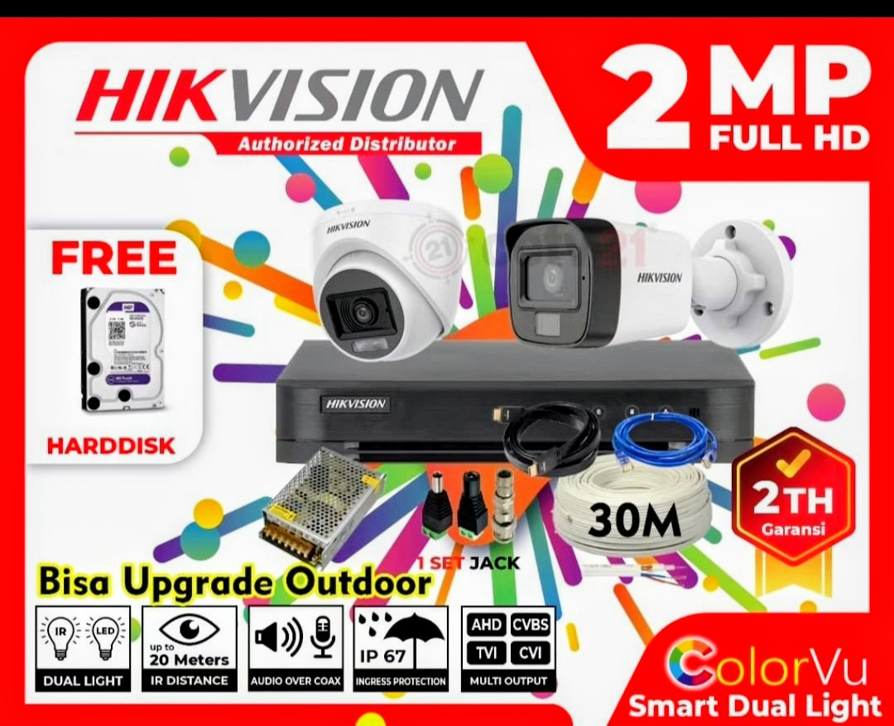

WEBSITE KELOMPOK 4 DASAR DASAR TJKT

<html lang="id">
<head>
    <meta charset="UTF-8">
    <meta name="viewport" content="width=device-width, initial-scale=1.0">
    <title>NC NETWORK - Solusi Wifi & CCTV Terpercaya Tegal</title>
    
</head>
<body>
    

        <header>
            <h1>🔌 NC NETWORK</h1>
            
Penyedia Jasa Instalasi Wi-Fi & CCTV Terpercaya di Tegal — Pengerjaan Rapi, Bersih, Bergaransi, dan Harga Terjangkau

        </header>

        <!-- BANNER UTAMA: Ganti dengan gambar banner kamu -->
        

        

            <h2>Selamat Datang di NC NETWORK</h2>
            
Ingin menikmati internet yang stabil dan lancar tanpa gangguan di setiap sudut ruangan rumah, kantor, atau tempat usaha? Atau ingin menjaga keamanan keluarga, aset, dan usaha Anda dengan pantauan kamera CCTV yang jernih baik siang maupun malam hari?

             
            
<strong>NC NETWORK</strong> hadir sebagai solusi terbaik untuk kebutuhan jaringan dan keamanan Anda. Kami adalah tim teknisi berpengalaman yang berdedikasi memberikan pelayanan profesional mulai dari survei lokasi, pemasangan yang rapi dan bersih, hingga pelayanan purna jual yang siap membantu kapan saja. Kami berkomitmen memberikan hasil kerja maksimal dengan harga yang jujur dan terjangkau tanpa biaya tersembunyi.

        

        <!-- === 🆕 FOTO POSTER === -->
 <h2 class="section-title">🖼️ Poster Promosi</h2>
     

         

             
         

         

             💡 Simpan & bagikan poster ini ke teman, tetangga, atau grup WhatsApp! 
             Semakin banyak yang tahu, semakin cepat pesanan datang! 🚀
         

         

             <a href="poster-nc-network.jpg" download class="btn-poster btn-download">
                 ⬇️ Download Poster
             </a>
             <button class="btn-poster btn-share" onclick="bagikanPoster()">
                 📤 Bagikan ke Teman
             </button>
         

     

                
<!-- 📶 PAKET WIFI -->

    <h2>📶 PILIHAN PAKET INSTALASI WIFI</h2>
    

        <!-- PAKET 1 -->
        

            
            <h4>Paket Keluarga AC1200</h4>
            
Mulai Rp 250.000

            

                <strong>Spesifikasi:</strong> 
                • Kecepatan: Hingga 1200 Mbps 
                • Standar: Dual Band 2.4GHz & 5GHz 
                • Jangkauan: 1 lantai rumah 
                • Kapasitas: 5–8 perangkat
            

            

                <strong>✅ Keunggulan:</strong> 
                Hemat biaya, sinyal stabil, mudah diatur, pemasangan rapi & uji coba langsung
            

            <a href="https://wa.me/6283171084270?text=Halo%20NC%20NETWORK,%20saya%20ingin%20pesan%20PAKET%20KELUARGA%20AC1200%20harga%20mulai%20Rp250.000" target="_blank" class="tombol-pesan">💬 Pilih & Pesan</a>
        

        <!-- PAKET 2 -->
        

            
            <h4>Paket Keluarga AX5400</h4>
            
Mulai Rp 450.000

            

                <strong>Spesifikasi:</strong> 
                • Kecepatan: Hingga 5400 Mbps 
                • Teknologi: Wi-Fi 6 Dual Band 
                • Jangkauan: Luas & tembus dinding 
                • Kapasitas: 10–15 perangkat
            

            

                <strong>✅ Keunggulan:</strong> 
                Sangat stabil, tahan gangguan, cocok streaming 4K & belajar online lancar
            

            <a href="https://wa.me/6283171084270?text=Halo%20NC%20NETWORK,%20saya%20ingin%20pesan%20PAKET%20KELUARGA%20AX5400%20harga%20mulai%20Rp450.000" target="_blank" class="tombol-pesan">💬 Pilih & Pesan</a>
        

        <!-- PAKET 3 -->
        

            
            <h4>Paket Home Mesh AC1200</h4>
            
Mulai Rp 650.000

            

                <strong>Spesifikasi:</strong> 
                • Sistem: Jaringan menyatu (2–3 unit) 
                • Kecepatan: 1200 Mbps stabil 
                • Jangkauan: Seluruh rumah bertingkat 
                • Fitur: Beralih otomatis ke sinyal terkuat
            

            

                <strong>✅ Keunggulan:</strong> 
                Tanpa zona mati, sinyal menyelimuti seluruh ruangan, cocok rumah luas
            

            <a href="https://wa.me/6283171084270?text=Halo%20NC%20NETWORK,%20saya%20ingin%20pesan%20PAKET%20HOME%20MESH%20AC1200%20harga%20mulai%20Rp650.000" target="_blank" class="tombol-pesan">💬 Pilih & Pesan</a>
        

        <!-- PAKET 4 -->
        

            
            <h4>Paket Pro Gaming AX11000</h4>
            
Mulai Rp 900.000

            

                <strong>Spesifikasi:</strong> 
                • Kecepatan: Hingga 11000 Mbps 
                • Teknologi: Wi-Fi 6 Tri-Band 
                • Fitur: Prioritas jalur khusus 
                • Kualitas: Komponen premium
            

            

                <strong>✅ Keunggulan:</strong> 
                Latensi sangat rendah, anti lemot, cocok gamer & pekerjaan berat tanpa gangguan
            

            <a href="https://wa.me/6283171084270?text=Halo%20NC%20NETWORK,%20saya%20ingin%20pesan%20PAKET%20PRO%20GAMING%20AX11000%20harga%20mulai%20Rp900.000" target="_blank" class="tombol-pesan">💬 Pilih & Pesan</a>
        

    

<!-- 📷 PAKET CCTV -->

    <h2>📷 PILIHAN PAKET INSTALASI CCTV</h2>
    

        <!-- PAKET 5 -->
        

            
            <h4>Paket Hikvision Full HD 2MP</h4>
            
Mulai Rp 400.000 / Kamera

            

                <strong>Spesifikasi:</strong> 
                • Resolusi: 2 Megapixel (1080p) 
                • Lensa: 3.6mm sudut pandang luas 
                • Tahan air: Ya (IP66) 
                • Pantauan: Lewat HP kapan saja
            

            

                <strong>✅ Keunggulan:</strong> 
                Gambar tajam siang hari, tahan cuaca, pemasangan kabel rapi & aman
            

            <a href="https://wa.me/6283171084270?text=Halo%20NC%20NETWORK,%20saya%20ingin%20pesan%20PAKET%20HIKVISION%20FULL%20HD%202MP%20harga%20mulai%20Rp400.000" target="_blank" class="tombol-pesan">💬 Pilih & Pesan</a>
        

        <!-- PAKET 6 -->
        

            
            <h4>Paket Dahua Full Color 2MP</h4>
            
Mulai Rp 525.000 / Kamera

            

                <strong>Spesifikasi:</strong> 
                • Resolusi: 2 Megapixel 
                • Teknologi: Gambar berwarna terus 
                • Tahan cuaca: Panas & hujan 
                • Aplikasi: Mudah & ringan
            

            

                <strong>✅ Keunggulan:</strong> 
                Detail jelas, awet tahan lama, garansi resmi produk, mudah dirawat
            

            <a href="https://wa.me/6283171084270?text=Halo%20NC%20NETWORK,%20saya%20ingin%20pesan%20PAKET%20DAHUA%20FULL%20COLOR%202MP%20harga%20mulai%20Rp525.000" target="_blank" class="tombol-pesan">💬 Pilih & Pesan</a>
        

        <!-- PAKET 7 -->
        

            
            <h4>Paket ColorVu 2MP</h4>
            
Mulai Rp 550.000 / Kamera

            

                <strong>Spesifikasi:</strong> 
                • Resolusi: 2 Megapixel 
                • Fitur: Rekaman BERWARNA malam gelap 
                • Lensa: Canggih penangkap cahaya 
                • Penyimpanan: Dapat ditambah HDD
            

            

                <strong>✅ Keunggulan:</strong> 
                Tidak butuh lampu tambahan, wajah & benda terlihat jelas berwarna
            

            <a href="https://wa.me/6283171084270?text=Halo%20NC%20NETWORK,%20saya%20ingin%20pesan%20PAKET%20COLORVU%202MP%20harga%20mulai%20Rp550.000" target="_blank" class="tombol-pesan">💬 Pilih & Pesan</a>
        

        <!-- PAKET 8 -->
        

            
            <h4>Paket Hikvision ColorVu 2MP</h4>
            
Mulai Rp 600.000 / Kamera

            

                <strong>Spesifikasi:</strong> 
                • Resolusi: 2 Megapixel 
                • Merek: Hikvision Internasional 
                • Ketahanan: Sangat awet & tahan cuaca 
                • Dukungan: Layanan teknis luas
            

            

                <strong>✅ Keunggulan:</strong> 
                Kualitas terjamin, warna sangat akurat, minim gangguan, awet bertahun-tahun
            

            <a href="https://wa.me/6283171084270?text=Halo%20NC%20NETWORK,%20saya%20ingin%20pesan%20PAKET%20HIKVISION%20COLORVU%202MP%20harga%20mulai%20Rp600.000" target="_blank" class="tombol-pesan">💬 Pilih & Pesan</a>
        

    

        

            <h2>💡 MENGAPA HARUS MEMILIH NC NETWORK?</h2>
            

                
✅ <strong>Pengerjaan Rapi & Bersih</strong> — Kabel tertata rapi di dalam saluran atau dinding, tidak merusak keindahan ruangan Anda

                
✅ <strong>Harga Jujur & Terjangkau</strong> — Biaya jelas di awal tanpa ada biaya tambahan yang mengejutkan di akhir pekerjaan

                
✅ <strong>Garansi Pelayanan</strong> — Kami memberikan jaminan pelayanan, siap membantu jika ada hal yang kurang maksimal pasca pemasangan

                
✅ <strong>Teknisi Berpengalaman</strong> — Ditangani langsung oleh tenaga ahli yang paham seluk-beluk instalasi jaringan dan keamanan

                
✅ <strong>Siap Survei Lokasi</strong> — Bisa kami kunjungi terlebih dahulu untuk memberikan penawaran yang pas dengan kondisi tempat Anda

                
✅ <strong>Layanan Cepat Tanggap</strong> — Respon pesan cepat dan waktu pengerjaan yang disesuaikan dengan jadwal Anda

                
✅ <strong>Siap Seluruh Wilayah</strong> — Melayani pemasangan di seluruh wilayah Tegal dan daerah sekitarnya

            

        

        

            <h2>📞 INGIN PASANG SEKARANG ATAU KONSULTASI DULU?</h2>
            
Jangan ragu untuk menghubungi kami kapan saja. Kami siap menjawab pertanyaan, memberikan saran terbaik, dan melayani pemasangan sesuai kebutuhan Anda.

            
Hubungi Admin: +62 831-7108-4270

            <a href="https://wa.me/6283171084270" target="_blank" class="tombol">💬 CHAT LANGSUNG VIA WHATSAPP</a>
            
Klik tombol di atas, kami akan segera merespons pesan Anda dengan ramah!

        

        <footer>© 2026 NC NETWORK — Semua Hak Dilindungi | Instalasi Wifi & CCTV Terpercaya Yogyakarta</footer>
    

</body>
</html>

